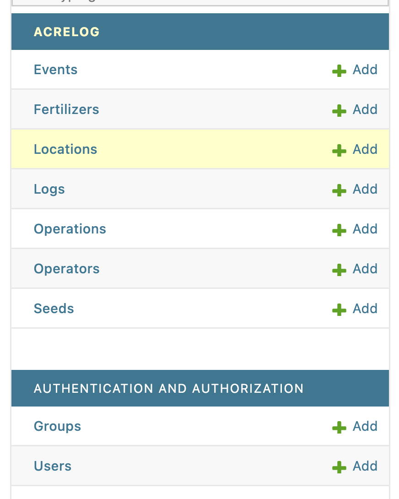

# *Project Overview*
## 1. What is the goal of the proposed web application?
This goal of this project is to make an web application that provides organized data of the field operation from ACRE.
## 2. Who are the primary users, and what will each of them need to be able to do.
The primary users of the web application will be the farm-workers or farm manager. Farm manager should be able to easily search the records and workers should be able to add the new records.
***

# *Data Model*

## 1. Insert the image of your data model

## 2. Describe what each of the classes represent and how they related to each other.
| Class    | Description |
| -------- | ------- |
| Location  | Class for the location data    |
| Fertilizer | Class for the fertilizer including fertilizer type and amount(lb/ac)     |
| Seeds    | Class for the seed including seed type and amount (lb/ac)    |
| Operations    | Class for the operations, indexed from 1-5   |
| Operators    | Class for the operator (workers)     |
| Events    | Class for the event (includes date, location, operation, and note)    |
| Logs    | Class for the log (includes location, operation, operator, date, and note)    |

## 3. Describe why you chose to model the data in this manner.
First of all, location, fertilizer, seed, operation, and operator should be distinguished as a single class since they are repeated for multiple events. and Events and Logs class were all made separately to include date, location, and event in order to find quickly. Additionally, I made a Events and Logs classes at the same time to make one class as back up for antoher. the difference between these two class is 'operator' since this is least favored contents for checking the record.

### Data Dictionary
| Variable     | Scope            | Description          | Acceptable Values | Data Type |
| ------------ | ---------------- | -------------------- | ----------------- | --------- |
|event         | Class            | Event ID number      |>0                 |int        |
|event         | Field, Attribute | Name of the field    |50 characters      |String     |
|date          | Field, Attribute | Name of the field    |50 characters      |String     |
|note          | Field, Attribute | Name of the field    |50 characters      |String     |
|operation     | Class            | operation ID number  |>0                 |int        |
|operation     | Field, Attribute | Name of the operation|50 characters      |String     |
|operator      | Class            | operator ID number   |>0                 |int        |
|operator_name | Field, Attribute | Name of the operator |50 characters      |String     |
|location      | Class            | field ID number      |>0                 |int        |
|location_name | Field, Attribute | Name of the field    |50 characters      |String     |
|spray         | Class            | sprayer ID number    |>0                 |int        |
|powerunit_type| Field, Attribute | Name of the sprayer  |50 characters      |String     |
